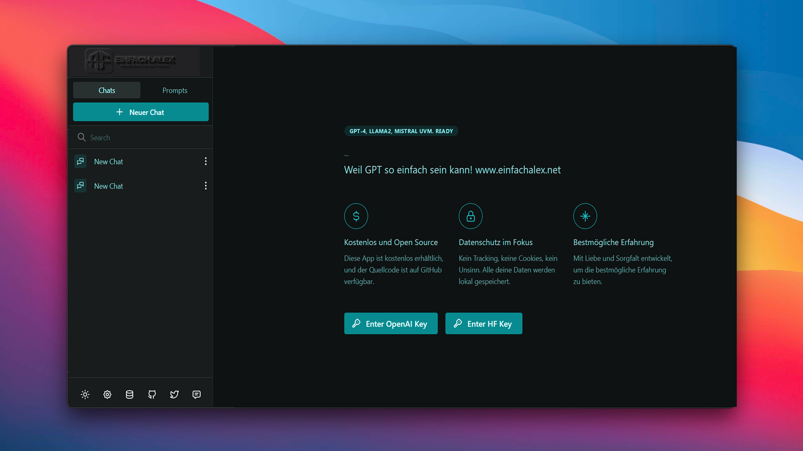

<h1 align="center">Chatpad AI</h1>
<h2 align="center">Premium quality UI for ChatGPT</h2>
<!-- <p align="center"><a href="https://chatpad.ai">Web App</a> & <a href="https://download.chatpad.ai">Desktop App</a></p> -->
<p align="center"><a href="https://chatpad.ai">Web App</a> & <a href="https://dl.todesktop.com/230313oyppkw40a">Desktop App</a></p>

Recently, there has been a surge of UIs for ChatGPT, making it the new "to-do app" that everyone wants to try their hand at. Chatpad sets itself apart with a broader vision - to become the ultimate interface for ChatGPT users.

### ⚡️ Free and open source

This app is provided for free and the source code is available on GitHub.

### 🔒 Privacy focused

No tracking, no cookies, no bullshit. All your data is stored locally.

### ✨ Best experience

Crafted with love and care to provide the best experience possible.

---

## Self-host using Docker

```
docker run --name chatpad -d -p 8080:80 ghcr.io/deiucanta/chatpad:latest
```

## Self-host using Docker with custom config

```
docker run --name chatpad -d -v `pwd`/config.json:/usr/share/nginx/html/config.json -p 8080:80 ghcr.io/deiucanta/chatpad:latest
```

## One click Deployments

<!-- Easypanel -->
[](https://easypanel.io/docs/templates/chatpad)

<!-- Netlify -->
[](https://app.netlify.com/start/deploy?repository=https://github.com/deiucanta/chatpad)

<!-- Vercel -->
[](https://vercel.com/new/clone?repository-url=https%3A%2F%2Fgithub.com%2Fdeiucanta%2Fchatpad&project-name=chatpad&repository-name=chatpad-vercel&demo-title=Chatpad&demo-description=The%20Official%20Chatpad%20Website&demo-url=https%3A%2F%2Fchatpad.ai&demo-image=https%3A%2F%2Fraw.githubusercontent.com%2Fdeiucanta%2Fchatpad%2Fmain%2Fbanner.png)

<!-- Railway -->
[](https://railway.app/template/Ak6DUw?referralCode=9M8r62)


## Give Feedback

If you have any feature requests or bug reports, go to [feedback.chatpad.ai](https://feedback.chatpad.ai).

## Contribute

This is a React.js application. Clone the project, run `npm i` and `npm start` and you're good to go.

## Credits

- [ToDesktop](https://todesktop.com) - A simple way to make your web app into a beautiful desktop app
- [DexieJS](https://dexie.org) - A Minimalistic Wrapper for IndexedDB
- [Mantine](https://mantine.dev) - A fully featured React component library
