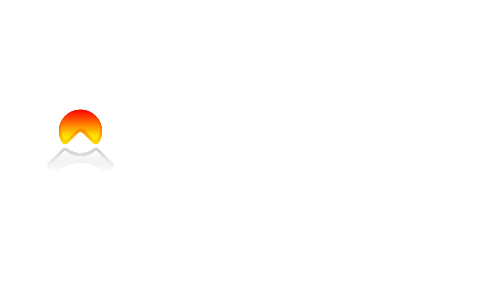

# Onerocket-Chatpad

Fork of chatpad with built in features to support the Onerocket.ai API. 

Onerocket is an AI broker/aggregator designed to provide a single path to many LLMs and AI systems. Additionally, it also provides simple one request endpoints to execute more complicated logic. 

## Build docker locally 

```
docker build -t or-chatpad .
```

## Run build locally: 

```
sudo docker run --name chatpad -d -p 8080:80 or-chatpad
```
